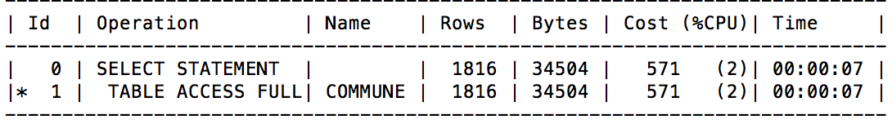

# Compte rendu Projet Base de donnée

## Partie 1, exportation

### Export de schéma

#### Fonction ToutesTable

La table ALL_TABLES est utilisée pour accéder au schéma. C'est la seule qui est accésible en pl/sql et qui est autorisée au niveau des droits, cependant on accède uniquement aux tables du schéma de l'USER connecté. Avec DBA_TABLES on accéde à toutes les tables, mais elle n'est pas accesible en pl/sql.

```
CREATE OR REPLACE
FUNCTION "ToutesTables" (P_USER_NAME IN VARCHAR) RETURN CLOB
IS
	out CLOB;
BEGIN

out := '';

FOR RECORD_INC IN (
SELECT dbms_metadata.get_ddl('TABLE', TABLE_NAME, P_USER_NAME) AS INC FROM ALL_TABLES WHERE OWNER=P_USER_NAME)
LOOP
	out := RECORD_INC.INC||out;
END LOOP;

return out;

END;
```

#### Fonction ToutesTablesInfos

Pour ajouter l'organisation logique et les informations sur le stockage physique, on active le parametre STORAGE.

```
CREATE OR REPLACE
FUNCTION            "ToutesTablesInfos" (P_USER_NAME IN VARCHAR) RETURN CLOB
IS
	out CLOB;
BEGIN

out := '';
DBMS_METADATA.set_transform_param(DBMS_METADATA.session_transform, 'STORAGE', true);

FOR RECORD_INC IN (
SELECT dbms_metadata.get_ddl('TABLE', TABLE_NAME, P_USER_NAME) AS INC FROM ALL_TABLES WHERE OWNER=P_USER_NAME)
LOOP
	out := RECORD_INC.INC||out;
END LOOP;

return out;

END;
```

### Export des données

Pour cette question, j'ai essayé plusieurs pistes, afin d'avoir une fonction la plus dynamique possible.

- Soit par du SQL dynamique, puis en stockant le contenu du select dans une table temporaire
- Soit avec le schéma des méta données, pour récupérer les noms des champs

Au final, aucune des solutions ne fonctionnaient. J'ai donc simplement créé une fonction qui retourne le contenu de la table région, en prenant le séparateur en parametre. Il faut modifier le coeur de la fonction si on souhaite extraire une autre table.

```
create or replace procedure factory_region (separateur varchar2) is
    cursor reg is select * from region;
begin
    for reg_t in reg loop
        dbms_output.put_line(reg_t.reg||separateur||reg_t.chef_lieu||separateur||reg_t.nom_reg);
    end loop;
    exception
    when others then dbms_output.put_line('Probleme affichage');
end;
/
```

## Partie 2, indexes

### Outils utilisés

Augmenter la largeur de la fenêtre pour visualiser correctement les plans d'execution :
```
set linesize 160
```

Pour activer/désactiver les indexes :
```
alter index PK_COMMUNE unusable;
alter index PK_COMMUNE rebuild;

```

Pour obtenir les plans d'execution :
```
explain plan for ...
select plan_table_output from table(dbms_xplan.display());
```

### Exercice 1

#### Vérifier la présence d'un index
```
select index_name, blevel, table_name FROM user_indexes WHERE index_name='PK_COMMUNE';
```

#### Étude de l'utilisation des indexes sur des requêtes

```
explain plan for select code_insee from commune;
```

Avec index :


Sans index :


Analyse  
L’index est utile car le code_insee est déjà présent dans les index. Il n’y a pas besoin de chercher d’autres informations dans les blocs.

```
explain plan for select code_insee, nom_com from commune;
```

Avec index :


Sans index :


L’index n’est pas utilisé car le nom_com n’est répertorié que dans les blocs, et il n’y a pas de filtrage sur le code insee (pas de “where”). Avec ou sans index il faudra faire un table access full.


```
explain plan for select nom_com from commune where code_insee='34192';
```

Avec index :


Sans index :


L’index permet de faire un filtrage en temps constant pour le code insee, donc améliore beaucoup les performances.

```
explain plan for select nom_com from commune where code_insee like '34%';
```

Avec index :


Sans index :


L’index est intéressant dans ce cas également, puisqu’on cherche tous les code_insee commencant par une valeur.

```
explain plan for select nom_com from commune where code_insee like '%34';
```

Avec index :


Sans index :



Ici l’index ne peut pas être utilisé car on ne commence pas par le début du code_insee. Le rangement fait par l’index n’est pas utile.

```
explain plan for select nom_com from commune where code_insee >= 34;
```

Avec index :


Sans index :


L’index n’est pas utile car il y a une utilisation d’une fonction (to_number) pour chacun des tuples. Si l’index était un int, il n’y aurait pas besoin de transformation, donc l’index serait utile.

```
explain plan for select nom_com from commune where code_insee in (‘34330’, ‘34331’, ‘34332’, ‘34333’);
```

Avec index :


Sans index :


L’opérateur IN utilse également l’index sur le code insee, de la même façon qu’avec un test d’égalité.
